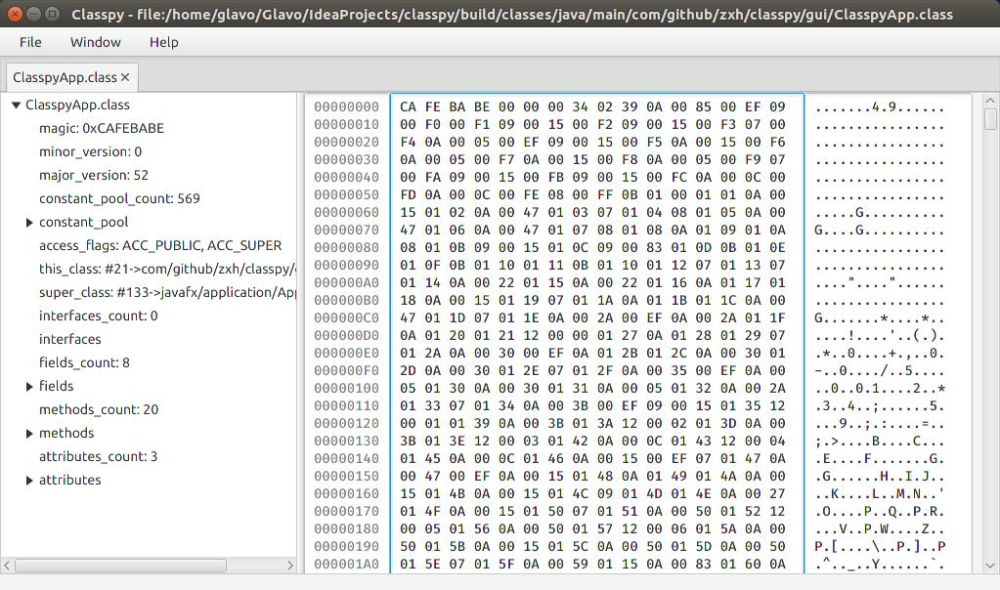
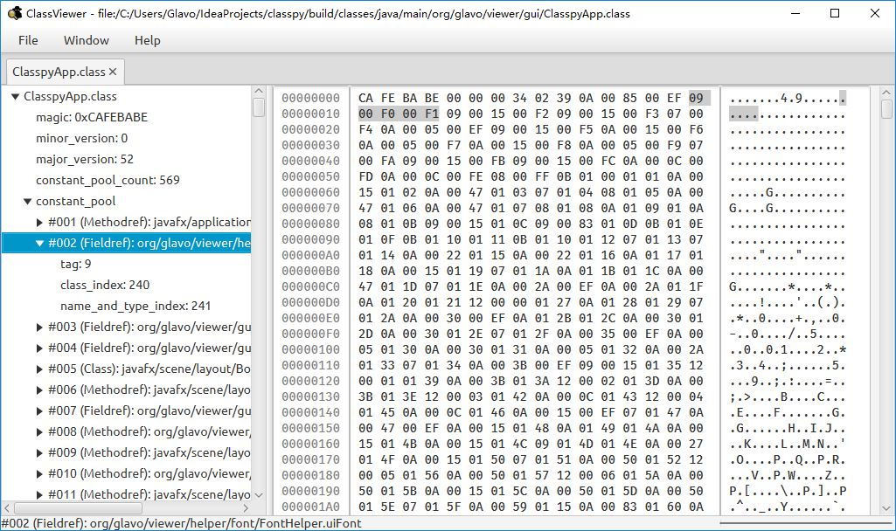

# ClassViewer

ClassViewer is a GUI tool for investigating Java class files.

## Inspiration

This tool forked from [classpy](https://github.com/zxh0/classpy). 


Features

* Understands class files described by [JVMS9](https://docs.oracle.com/javase/specs/jvms/se9/html/jvms-4.html)
* Displays parsed class file as tree and hex text
* The corresponding hex text is highlighted when you select a tree node

## Build
```shell
gradle jar
```

## Run
```shell
java -jar build/libs/ClassViewer-2.0-SNAPSHOT.jar
```

## Screenshots



